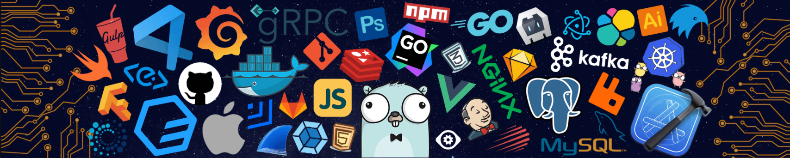

# Hey, I am Murilo! Great to see you here! 

 

I’m a 32-year-old Brazilian who splits his time between programming, being a father, a husband, and taking my jet ski out to feel the wind on my face (and, occasionally, taste a few bugs along the way). I hold a degree in Information Systems, I’m married to the most amazing partner I could ask for, and I’m the proud father of two treasures: Lara, my spirited 7-year-old daughter who keeps me on my toes, and Lucas, my 9-month-old explorer who’s already perfected the art of turning any room into chaos. Oh, and let’s not forget Margot, our little dog who acts like she’s the CEO of the house.

My passion for programming started at 17, and by 21, I had already founded my own software development company. Over the years, I had the privilege of working on projects for clients of all sizes and industries—ranging from local businesses to global giants like Philips, Klabin, and the Rosicrucian Order. Leading a phenomenal team was rewarding, but I always made it a point to stay hands-on, coding alongside the team and tackling the toughest challenges head-on.

When my daughter was born, everything changed. I realized I wanted to be more present for my family while continuing to do what I love most—coding. So, I took a leap and joined Luxury Presence, a highly innovative U.S.-based real estate startup, as a Software Engineer.

Nearly a year later, an incredible opportunity came my way: a role at Uber. It was a no-brainer, and three years later, I’m still here, creating solutions that impact millions of people and embracing every challenge that comes my way. And when I’m not deep into code, you’ll probably find me out in nature on my jet ski or convincing my kids that swimming in the river is just as fun as staying glued to a tablet.

 

    Find out more about my work in my Website/LinkedIn and feel free to drop me a message or schedule a meeting
      
	
	
  
	

---

## ‍💻 Tech Stack

### Languages

 

### Frameworks & Libraries

 

### Databases

 

### Infrastructure & CI/CD

 

### Tools & Platform

 
